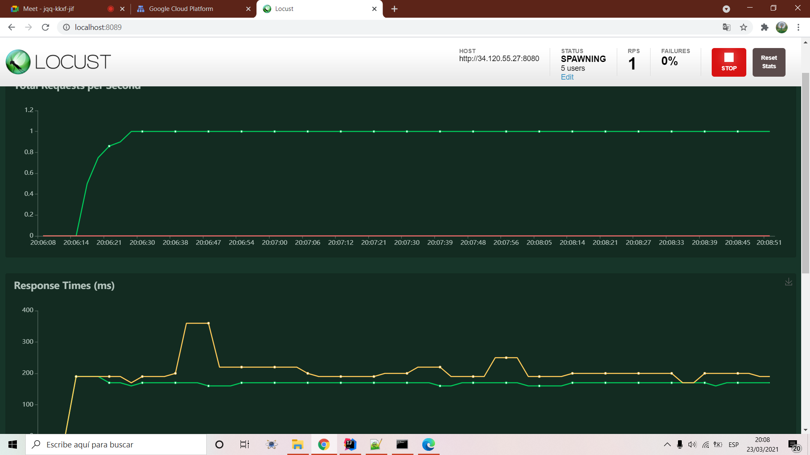
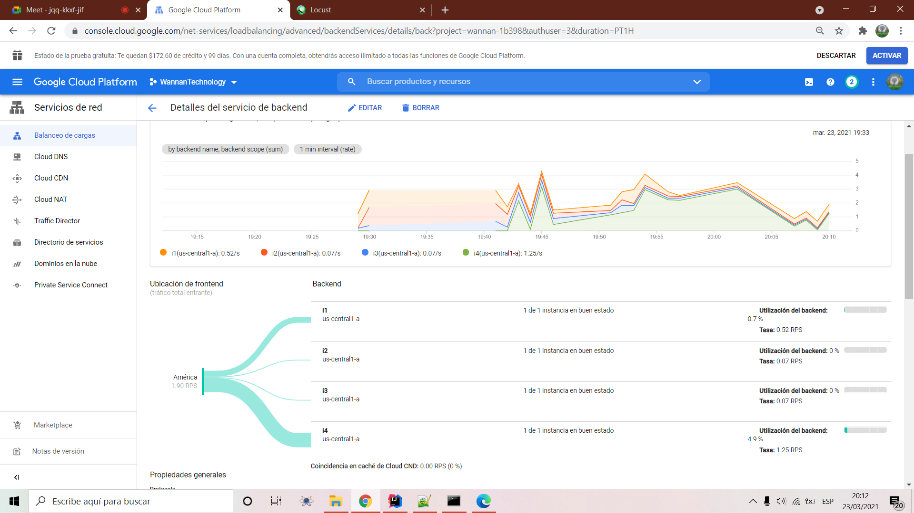

# MANUAL LOCUST

```
    pip install locust
```

### Import del servicio de locust

En python agrega las siguientes dependencias

```
   import json
    from sys import getsizeof
    from locust import HttpUser, task, between, events
```

Se ejecuta al iniciar la carga de usuarios.

```
    def on_start(self):
        print(">> MessageTraffic: Iniciando el envio de tráfico")
        self.general = User()
        self.general.cargar()
```


Creación de post, en este metodo se envian los valores al balanceador de carga.

```
    @task
    def PostMessage(self):
            if(self.general.passd):
                data = self.general.getUser()
                if (data is not None):
                    data_to_send = json.dumps(data)
                    print(data_to_send)
                    self.client.post("/", json=data)
                    self.general.yanain()
                else:
                    self.stop(True);
            else:
                print(f'Usuarios ejecutados: {self.general.users}')
                self.stop(True)
```





# MANUAL BALANCEADOR DE CARGA

### CREACION DEL BALANCEADOR DE CARGA

En GCP, crea un grupo de instancias con tus vm., luego genera un balanceador de carga dirigiendote a redes, en balanceador de carga, 
escoge un balanceador de carga over https, crea un servicio de backend ingresando tu grupo de instancias, y genera un verificador de estado en el puerto 80 TCP, el cual servira para identificar que servidor se encuentra disponible para procesar la tarea, es necesario que todos los que procesaran la tarea esten disponibles,

Luego de configurar nuestro balanceador de carga observaremos un comportamiento identico al siguiente:

