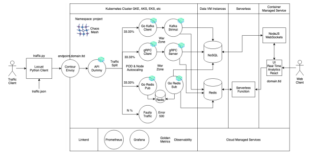

UNIVERSIDAD DE SAN CARLOS DE GUATEMALA

FACULTAD DE INGENIERÍA

ESCUELA DE CIENCIAS Y SISTEMAS

SISTEMAS OPERATIVOS 1

PROYECTO 2
-------------------------------------------
###### Guatemala, Mayo 2021

### INTEGRANTES

#### Grupo 20

|Carnet|Nombre|
|--|--|
|201612331|José Orlando Wannan Escobar|
|201504051|Asunción Mariana Sic Sor|
|201602440|Jonathan Baudilio Hidalgo Perez|
|201612101|Abner Abisai Hernández Vargas|

### TABLA DE CONTENIDO

* Descripcion 

Se solicita construir un sistema genérico de arquitectura distribuida que muestre
estadísticas en tiempo real utilizando Kubernetes y service mesh como Linkerd y
otras tecnologías Cloud Native. En la última parte se utilizará una service mesh para
dividir el tráfico. Adicionalmente, se generará faulty traffic con Linkerd y Chaos Mesh
para implementar Chaos Engineering. Este proyecto se utilizará para visualizar las
personas vacunadas contra la COVID-19 alrededor del mundo.

* Servicios de Mensajería

    * [GRPC](https://github.com/JoWan1998/SO1_P2/blob/master/GRPC/README.md)
    * [Kafka](https://github.com/JoWan1998/SO1_P2/blob/master/KAFKA/README.md)
    * [Redis Pub/Sub]()
    * [Defaulty Traffic]()
    

* Tecnologias
    * [Locust](https://github.com/JoWan1998/SO1_P2/tree/master/LOCUST)
    * [Traffic splitting ]()
    * [Chaos Engineering ]()
    * [Linkerd]()

* Almacenamiento
    * [Mongo BD](https://github.com/JoWan1998/SO1_P2/blob/master/NODEJS/MANUAL.md)
    * [Redis BD](https://github.com/JoWan1998/SO1_P2/blob/master/RedisBD/README.md)

* Serverless

    * [API Serverless](https://github.com/jonhiidalgo92/api)
    * [Deploy]()
    * [Funcionamiento]()

* Aplicacion Web

    * [Aplicacion]()
    * [Deploy]()

